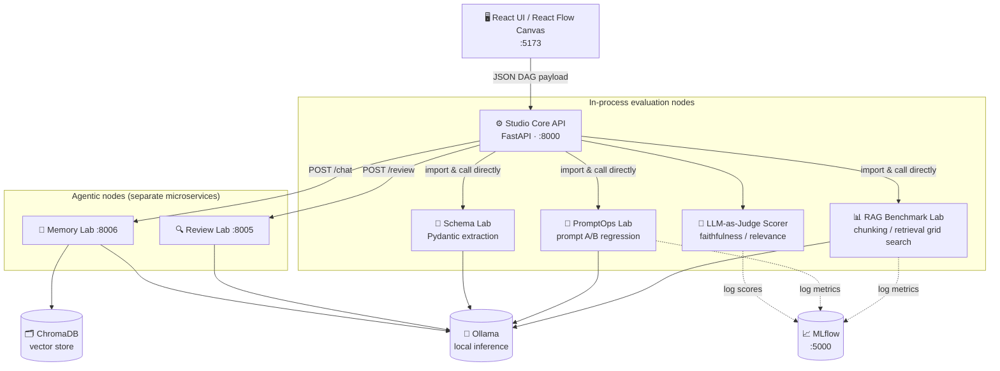
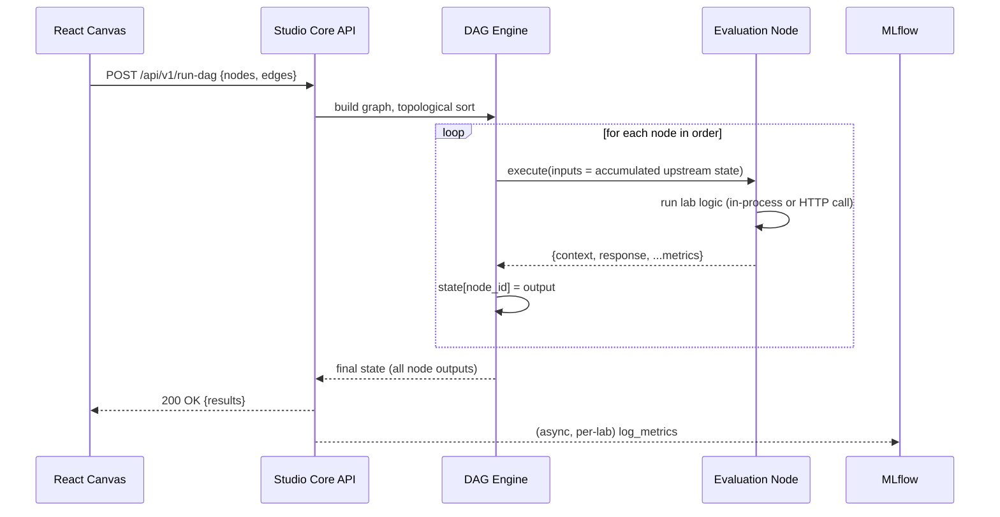

# 🎯 LLMOps Studio — Centralized DAG-Based Evaluation Engine


**LLMOps Studio** is a visual, DAG-based evaluation platform for local LLM pipelines. It lets you wire together retrieval, prompting, structured-extraction, code-review, and memory experiments as a drag-and-drop graph, execute them against a local Ollama instance, and get back reproducible, MLflow-tracked metrics — without writing a new evaluation script for every experiment.

It started as the dedicated telemetry/testing harness for the *Finwise Scribe* thesis (an edge-hardware neuro-symbolic market-forecasting engine) and evolved into a general-purpose "Grafana for personal LLM projects": a plug-and-play evaluation layer meant to be reused across future projects, not a one-off script per repo.

---

## Table of Contents

- [Why this exists](#why-this-exists)
- [Architecture](#architecture)
- [The Node Output Contract](#the-node-output-contract)
- [DAG Execution Sequence](#dag-execution-sequence)
- [Node Catalog](#node-catalog)
- [Microservices & Port Map](#microservices--port-map)
- [Quick Start](#quick-start)
- [API Reference](#api-reference)
- [Known Limitations](#known-limitations)
- [Roadmap](#roadmap)

---

## Why this exists

Evaluating local LLM pipelines usually means writing a throwaway script per experiment: one for RAG chunking sweeps, another for prompt A/B tests, another for schema-extraction regression. Each script re-implements the same plumbing (call Ollama, log to MLflow, compute faithfulness/relevance) with slightly different conventions, and none of them compose with each other.

LLMOps Studio treats each of those experiment types as a **node type** with a standard input/output contract, and a DAG engine that executes them in topological order, feeding upstream results into downstream nodes. Every laboratory (RAG Benchmark, PromptOps, Schema, Review, Memory) is a separately deployable/importable Python package; Studio Core imports the evaluation labs in-process for low-latency DAG execution, and calls the agentic labs (Review, Memory) over HTTP since those represent independent, stateful services.

## Architecture



Studio Core exposes `/api/v1/run-dag`, which accepts a graph of `{id, type, config}` nodes and `{source, target}` edges, topologically sorts it, and executes each node with the accumulated state of every upstream node available as `inputs`.

## The Node Output Contract

Every node's `execute()` may be consumed by a downstream evaluator (most commonly `FaithfulnessRelevanceScorerNode`), so any node whose output could feed a scorer **must** return two string fields:

- `context` — the grounding material the node worked from (retrieved chunks, reference document, input code snippet, ...)
- `response` — the generated/produced output to be scored

This is documented directly on `BaseNode.execute()` so new node authors don't miss it. Two upstream nodes (`RAGConfigBenchmarkNode`, `PromptComparisonNode`) originally omitted these fields, which meant the scorer silently evaluated empty strings and produced meaningless 0/1 scores — this class of bug is why the contract is now written down explicitly rather than left implicit.

## DAG Execution Sequence



## Node Catalog

| Node type | Backing lab | Execution mode | Purpose |
|---|---|---|---|
| `prompt_comparison` | PromptOps Lab | in-process | A/B regression between prompt versions |
| `rag_benchmark` | RAG Benchmark Lab | in-process | Grid search over chunk size/overlap/model |
| `schema_validation` | Schema Lab | in-process | Strict Pydantic extraction from unstructured text |
| `llm_judge_scorer` | `llmops-common` | in-process | Faithfulness/relevance scoring of any upstream `context`/`response` pair |
| `code_review` | Review Lab | HTTP (`:8005/review`) | Multi-agent static analysis (security/style/performance) |
| `conversational_memory` | Memory Lab | HTTP (`:8006/chat`) | Context-retention testing against ChromaDB-backed memory |

## Microservices & Port Map

| Service | Host Port | Internal Port | Description |
|---|---|---|---|
| **Studio Core API** | `8000` | `8000` | FastAPI backend: DAG execution, project registry, model discovery |
| **Frontend UI** | `5173` | `80` (nginx) | React/Vite SPA — canvas, node config panel, live results |
| **RAG Benchmark Lab** | `8002` | `8000` | Chunking/model grid search, golden-dataset batch regression |
| **PromptOps Lab** | `8003` | `8000` | Prompt version A/B evaluation |
| **Schema Lab** | `8004` | `8000` | Structured extraction + Pydantic validation |
| **Review Lab** | `8005` | `8000` | Multi-agent code review (LangGraph supervisor pattern) |
| **Memory Lab** | `8006` | `8000` | Conversational memory / context-window testing |
| **Ollama** | `11435` | `11434` | Local LLM inference |
| **MLflow** | `5000` | `5000` | Experiment tracking |
| **ChromaDB** | `8088` | `8000` | Vector store (Memory Lab, RAG Lab) |

> Every lab listens on `8000` **inside** its own container — the host ports above are just how `docker-compose.yml` disambiguates them from the host side. Node config panel model dropdowns are populated live from `GET /api/v1/models`, which proxies Ollama's `/api/tags` (with a static fallback if Ollama isn't reachable yet).

## Quick Start

**Recommended: Docker Compose** (brings up Ollama, MLflow, ChromaDB, Studio Core, the UI, and all five labs together):

```bash
cd ../../LLMOpsPlatform/llmops-platform
docker compose up --build
```

Then open `http://localhost:5173`.

**Native / development mode** (faster iteration on Studio Core itself):

```bash
# 1. Start shared infra (Ollama, MLflow, Chroma) via the platform compose file
cd ../../LLMOpsPlatform/llmops-platform && docker compose up -d ollama mlflow chromadb

# 2. Install this package + its sibling labs in editable mode
cd ../../LLMOpsStudio/llmops-studio
python -m venv .venv && source .venv/bin/activate  # .venv\Scripts\activate on Windows
pip install -e .

# 3. Run the API
uvicorn llmops_studio.app:app --reload --host 0.0.0.0 --port 8000

# 4. In a separate terminal, run the UI
cd ../../LLMOpsUI && npm install && npm run dev
```

## API Reference

| Endpoint | Method | Description |
|---|---|---|
| `/health` | GET | Liveness check |
| `/api/v1/projects` | GET | List registered project configs (YAML-based project registry) |
| `/api/v1/nodes` | GET | List available node types for the canvas palette |
| `/api/v1/models` | GET | Proxies Ollama `/api/tags`; feeds the node config model picker |
| `/api/v1/run-dag` | POST | Executes a `{nodes, edges}` DAG and returns per-node results |

## Known Limitations

- Cold Ollama model loads can take 10–30s; the UI surfaces a loading state but does not yet stream partial progress.
- The DAG engine executes nodes sequentially, not in parallel, even when the graph has independent branches.
- `code_review` / `conversational_memory` nodes call their labs over plain HTTP with no retry/backoff — a transient network blip fails the whole DAG run.

## Roadmap

- Training nodes (LoRA/QLoRA over SSH to a remote GPU box)
- Deployment nodes (canary rollout, model packaging)
- Parallel execution of independent DAG branches

---

*Part of the [LLMOps Labs](../../LLMOpsPlatform/llmops-platform) ecosystem — see the platform README for how this fits together with the other laboratories.*
